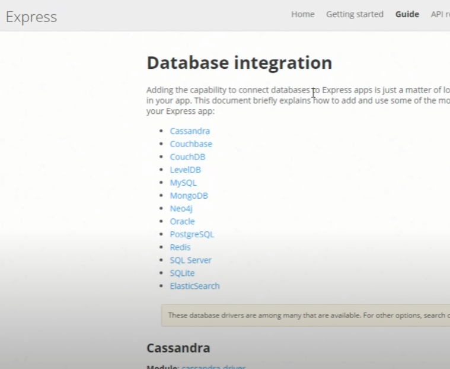

# Express - Guia

Express es un modulo de npm y un framework de node.js o un framework de java scrip que nos permite crear aplicaciones web del lado del servidor.

Es un framawork

## Captura de referancia


## Informacion importante

- Aprendi esto con un video de Fazt

- Podemos aprender con la documetacion de express pero el video de Fazt esta completo.

- El motor de plantillas que usamos es `ejs` pero tambien existen otros como: **pug**, **handlebas**. Dejare la doc de todos en *biografias. Es cuestion de gustos, todos nos permiten hacer lo mismo.

- **nodemon** lo quee hace es vigilar mi codigo de javascript. Cuando yo haga un cambio en javascript y guarde nodemon va a reiniciar el servidor por mi.

### Herramientas usadas

- **node.js**
- **Express.js**
- **nodemon**

### bibiografia

[Fazt video](https://youtu.be/794Q71KVw1k)

[Documentacion de express](https://expressjs.com/es/)

[como instalarlo](https://expressjs.com/es/starter/installing.html)

[Doc completa de nodemon](https://github.com/remy/nodemon#usage)

[Doc 1 Metodos de solicitud HTTP](https://expressjs.com/en/starter/basic-routing.html)

[Doc 2 Metodos de solicitud HTTP](https://expressjs.com/en/5x/api.html#app.get)

[ejs doc](https://ejs.co/)

[pug doc](https://www.npmjs.com/package/pug)

[handlebars doc](https://handlebarsjs.com/guide/#template-comments)

## Linea de tienpo

### Instalación de express

> 1. Primero he creado una carpeta llamada `Expressjs`

> 2. abrimos una terminal y nos ubicamos en el proyecto

### Creamos el servidor con node

> 3. creamos un archivo `index.js` en nuestra carpeta pricipal y colocamos este codigo:

```js
const http = require('http');

const server = http.createServer((req, res) => {
    res.status = 200;
    res.setHeader('Content-tipe', 'text/plain');
    res.end('Hello World');
});

server.listen(3000, () => {
    console.log('Server on port 3000');
});
```

> 4. Veremos que esta cuncionando con `node index.js` en el cmd. Eso dignifica que ya emos creado el servidor con node.js

---

### Creamos el servidor con Express

> 5. Lo que hicimos hasta ahora es un servidor basico. Así que de aquí para adelante empezaremos con Express

> 6. Crearemos el package.json con `npm init -y` en cmd

> 7. Ahora ya podemos e instalaremos express con `npm install express` en cmd

> 8. Cambiaremos el codigo de nuestro archivo `index.js` por codigo de express

```js
const express = require('express');

const app = express();

app.listen(3000, () => {
    console.log('Server on port 3000');
});
```
> 9. Veremos que esta cuncionando con `node index.js` en el cmd

> 10. En este punto mi servidor no tiene ruta. Etonces lo creamos

```js
const express = require('express');
const app = express();

app.get('/', (req, res) => {
    res.send('Hello World');
});

app.listen(3000, () => {
    console.log('Server on port 3000');
});
```
> 11. Ya tenemos el `Hello World` Eso significa que ya hemos creado el servidor.

___

### Enrutamiento

> 12. Enrutamiento. El manejo de las rutas. Rearemos multiples rutas

```js
//enrutamiento
app.get('/abaut', (req, res) => {
    res.send('Abaut me');

});
app.get('/contact', (req, res) => {
    res.send('Form contact');

})
```

### Nodemon

> 13. Instalaremos nodemon con `npm install --save-dev nodemon` o `npm i nodemon -D` es lo mismo cualquiera de los dos. Esta es una instalacion local, es decir se instala solo el la carpeta de mi proyecto y no en todo el sistema.

> 14. Ahora que nodemon ya esta instalado lo usaremos con `npx nodemon index.js` es lo mismo que hariamos con (node index.js) en consola

### peticiones

> 15. enviamos como ejemplo un nombre y un apellido

```js
//enrutamiento
app.get('/user', (req, res) => {
    res.json({
        username: 'Cameron',
        lastname: 'Howe'
    });
});

```
### Metodos de solicitud HTTP 

Aquí algunos ejemplos que no tienen por que ser 100% funcional ya que para testearlos nos haria falta el software **Postman**

> 16. `GET`: se utiliza para solicitar recursos o datos del servidor.

```js
app.get('/user', (req, res) => {
    res.json({
        username: 'Cameron',
        lastname: 'Howe'
    });
});
```

> 17. `POST`: se utiliza para enviar datos al servidor para que los procese y los almacene en la base de datos.

```js
app.use(express.json()); //es para que express entienda los datos json

app.post('/user', (req, res) => {
    console.log(req.body); //muestra en consola el valor json que enviamos por Postman
    res.send('POST RQUEST RECEIVED'); //impime en pantalla este valor
});
```

> 18. Aqui recibimos parametros a traves de la url

```js
app.post('/user', (req, res) => {
    console.log(req.params); //muestra en consola el valor que enviamos por la URL
    rers.send('Recepciond de variable'); //impime en pantalla este valor
});
```

> 19. `DELETE`: se utiliza para eliminar un recurso específico del servidor.

```js
app.delete('/user/:userId', (req, res) => {
    res.send(`User ${req.params.userId} deleted`);
    res.send('DELETED REQUEST');
});
```

> 20. `PUT`: se utiliza para actualizar o reemplazar un recurso específico en el servidor.

```js
app.delete('/user/:id', (req, res) => {
    res.send(`User ${req.params.id} update`);
    res.send('UPDATE REQUEST RECEIVED');
});
```
>21. `ALL`: no es un método de solicitud HTTP estándar. Algunos marcos de trabajo pueden usarlo como una convención para crear múltiples rutas de solicitud HTTP para un recurso en particular. Lo que hace app.All es hacer de paso, es decir que todas las ruta establecidas pasaran primero por el.

```js
app.all('/user', (req, res, next) => {
    console.log('Por aquí paso');
    next(); // el next es para que pase y no se quede en este paso.
})
```

aqui tenemos una guia rapida de lo que acabamos de ver [aquí](https://expressjs.com/en/starter/basic-routing.html)

### Middleware

> 22. Middleware es un intermediario, algo similar al app.all con la diferencia que podemos utilizarlo para cualquier ruta que creemos

```js
//middleware
function logger(req, res, next){
    console.log(`Routine Received ${req.protocol}://${req.get('host')}${req.originalUrl}`);// esto devuelve la url
    next();
}
```

> 22. Podemos hacer eso lo anterior con un middleware yaexistente (no todos los middlewarwe lo deberemos crear. podemos usar algunos ya existentes). En este caso usaremos **Morgan**

> 23. buscarmos **morgan npm** [aquí el link](https://www.npmjs.com/package/morgan) y lo instalamos con `npm i morgan` en consola.

> 34. [aquí parametros para funciones](https://www.npmjs.com/package/morgan#combined) y diginatmos esto para mostrar por consola diferentes formas de url

```js
const morgan = require('morgan');
//middleware morgan
app.use(morgan('dev'))
```

### Static Files (otro tipo de middleware)

> 35. ataravez de un simple middleware especificamos los archivos estaticos y lo hacemos vicibles en el fronten

```js
app.use(express.static('public'));
```

### Settings

> 36. para la configuración del servidor usaremos un metodo llamado `set` y get

> 37. Estos son como variables. Por ejemplo imprimire en consola **Fazt Express Tutoia**

```js
app.set('appName', 'Fazt Express Tutorial');

app.listen(3000, () => {
    console.log(app.get('appName')) // aqui lo estamos imprimiendo
    console.log('Server on port 3000');
});
```

> 38. O cambiar el puerto con una linea de tiempo

```js
app.set('port', 3000);
// llamamos con port donde antes habia números
app.listen(app.get('port'), () => {
    console.log(app.get('appName'))
    console.log('Server on port', app.get('port'));
});
```

### Motores de plantillas

> 39. Instalaremos el motor de plantillas mas comun llamado `ejs` con el siguiente comando en consola `npm install ejs`

> 40. No es necesario importar este motor de plantillas simplemete lo especificamos en la configuración

```js
//Settings
app.set('view engine', 'ejs');
```

> 41. ahora creamos la siguiente ruta en la carpeta de nuestro proyecto `/views/index.ejs` y dentro de ese archivo index creamos un simple html:5

> 42. Cuando viciten la ruta inicial de mi aplicación yo quiero que renderice el `index.ejs`

```js
//Enrutamiento
app.get('/', (req, res) => {
    res.render('index.ejs')
});
```

> 43. Ahora quiero que envie un objeto

```js
//Enrutamiento
app.get('/', (req, res) => {
    const data = [{name: 'john'},{name: 'joe'},{name: 'cameron'}];
    res.render('index.ejs', {people: data});
});
```

>44. Y para mostrar los datos en pantalla uaremos sintaxis de `ejs` que es un poco extraña. Esto tambien es conocido como datos dinamicos.

```html
<body>
    <h1>Pesonas!</h1>
    <ul>
        <% people.forEach(function (personas){ %>
            <li> <%= personas.name %> </li>
        <% }) %>
    </ul>
</body>
```


### Bases de datos y recomendaciones de framewoks

> express es bansante adnostico en canto a la base de datos una de las opciones que tenemos son **mogoDB**, **Oracle**, **postgreSQL**



> tambien hay otro concepto con las bases de datos llamados **ORM**
en orms tenemos **sequelizejs** o **mongoosejs** 

> el **ORM** ovita que escribas sintaxis de la base de datos atraves de funcones javascript esto es muy conveniente a la hora de cambiar de base de datos.

> tambien Express no es el unico framework de bakend de nodejs. Es el mas poular pero tambien hay otros como por ejemplo: **Adonisjs**, **Sailsjs**, **Koajs**, **Hapijs** o **Krakenjs**

## Desarrollo del proyecto
### tema
- y punto a considerar
